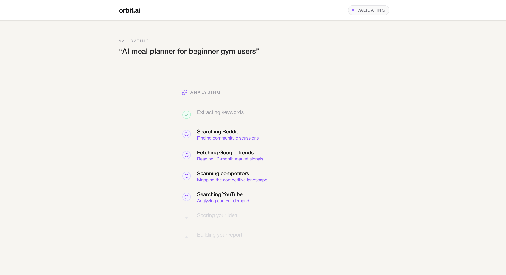
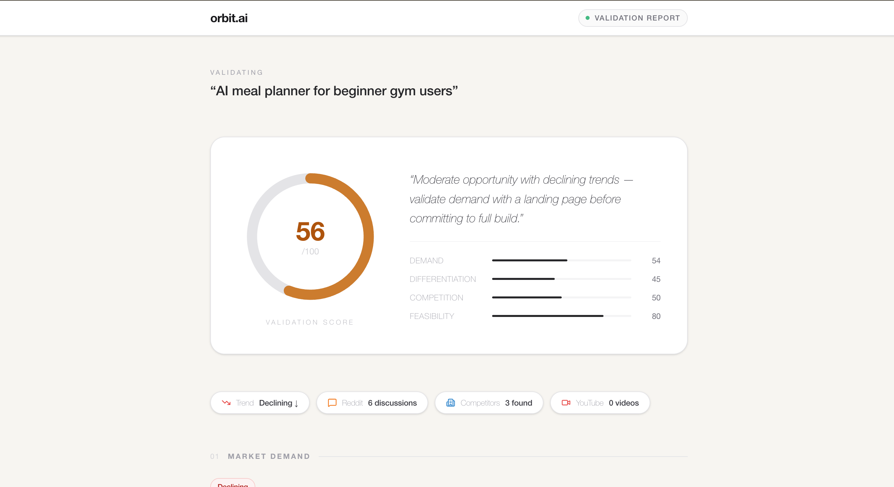
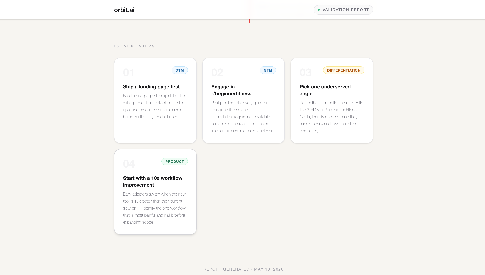

# orbit.ai — Validate your startup

orbit.ai helps founders validate startup ideas before spending months building them.

Enter a startup idea, MVP concept, or prototype description and orbit.ai automatically analyzes market demand, identifies competitors, detects trends, uncovers opportunities, and generates strategic recommendations using AI and live web intelligence.


---

## Tech stack

| Layer | Technology |
|---|---|
| Framework | Next.js 16 App Router, TypeScript |
| Styling | Tailwind CSS v4, Framer Motion |
| Data & intelligence | [Anakin API](https://anakin.io) |
| Scoring | Algorithmic — no LLM in the critical path |
| Deployment | Vercel |

**Anakin API — Wires used**

orbit.ai uses four Anakin integrations, all running in parallel per request:

- **Google Trends Wire** (`gt_interest_over_time`, `gt_related_queries`) — fetches a 12-month search interest timeline, momentum direction (rising / flat / declining), rising breakout queries, and top geographic regions for the idea's keywords
- **Reddit Search** — pulls the most relevant community discussions to surface organic pain points and user interest signals
- **Search Citations** — scans the web for competitor pages and market overviews, used to identify and describe competing products
- **YouTube Search** — finds relevant video content to measure audience awareness and content demand in the space

All four calls are made concurrently. Results feed directly into the algorithmic scorer — no secondary LLM call needed.

---

## What it does

The platform combines Google Trends intelligence, competitor research, Reddit signals, and YouTube content analysis to generate structured startup validation reports. Founders get clear answers to:

- Is there real market demand for this idea?
- Who are the competitors, and how crowded is the space?
- Where do the opportunities and gaps exist?
- How should the product be positioned?

orbit.ai is designed to feel like an AI startup advisor — turning hours of market research into actionable insights within seconds.

---

## How it works

**1. Enter your idea**
Type a startup idea, product concept, or problem statement. The analysis runs in 10–15 seconds.

**2. Live intelligence pipeline**



orbit.ai runs a parallel evidence-gathering pipeline:
- **Google Trends** — 12-month search interest timeline, momentum direction, rising queries, and top regions
- **Reddit** — community discussions, pain points, and organic interest signals
- **Competitor scan** — identifies known players in the space with descriptions
- **YouTube** — content volume and demand signals

**3. Validation report**



The report includes:
- **Validation score** (0–100) with a ring gauge — scored across Demand, Differentiation, Competition, and Feasibility
- **One-line verdict** — a plain-language summary of what the score means
- **Signal bar** — at-a-glance trend momentum, Reddit discussion count, competitor count, and YouTube video count
- **Market demand panel** — sparkline chart of search interest over time
- **Opportunities** — evidence-grounded reasons to pursue the idea
- **Risks** — honest red flags based on the data

**4. Strategic recommendations**



Numbered next-step cards covering go-to-market strategy, positioning, differentiation angles, and product focus — each grounded in the evidence gathered.

---

## Setup

```bash
# Install dependencies
npm install

# Add environment variables
cp .env.local.example .env.local
# Fill in ANAKIN_API_KEY

# Run locally
npm run dev
```

Open [http://localhost:3000](http://localhost:3000).

---

## Environment variables

| Variable | Description |
|---|---|
| `ANAKIN_API_KEY` | API key from [anakin.io](https://anakin.io) — used for all data sources |
